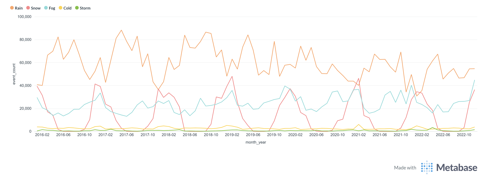
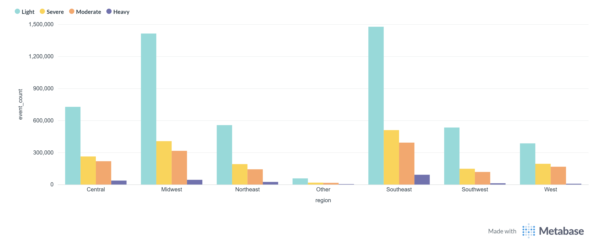
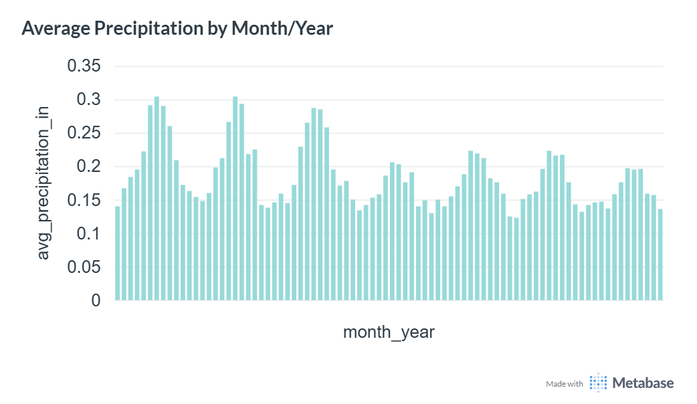

 HEAD
# 🌩️ US Weather Events Data Pipeline (2016–2022)

An end-to-end data engineering pipeline that ingests, cleans, models and visualises
**8.6 million US weather events** recorded across **2,071 airport stations** between
January 2016 and December 2022.

---

## 📋 Table of Contents

- [Project Overview](#project-overview)
- [Architecture](#architecture)
- [Tech Stack](#tech-stack)
- [Data Model](#data-model)
- [Data Quality](#data-quality)
- [Dashboard & Key Insights](#dashboard--key-insights)
- [Airflow Pipeline](#airflow-pipeline)
- [How to Run](#how-to-run)
- [Dataset](#dataset)

---

## Project Overview

This project builds a production-style data pipeline for analysing long-term
US weather patterns. Starting from a raw 1GB CSV file, the pipeline:

1. **Ingests** all 8.6M rows into a PostgreSQL raw layer
2. **Cleans and validates** timestamps, coordinates, severity levels and event types
3. **Models** the data into fact and dimension tables ready for analysis
4. **Orchestrates** monthly runs automatically via Apache Airflow
5. **Visualises** key trends through a Metabase dashboard

**Business goals addressed:**
- Detect increases in storm/severe weather frequency over time
- Identify seasonal severity shifts by region
- Support resource allocation decisions with precipitation trend data

---

## Architecture

```
CSV File (1 GB · 8,627,181 rows)
          │
          ▼
┌─────────────────────────┐
│   Python ETL Script     │  ← ingest_data.py
│   (pandas + psycopg2)   │
└────────────┬────────────┘
             │
             ▼
┌─────────────────────────────────────────────┐
│              PostgreSQL                      │
│                                             │
│  raw.weather_events_raw   (8,627,181 rows)  │
│          │                                  │
│          ▼                                  │
│  staging.stg_weather_events (8,627,181)     │
│  staging.stg_stations                       │
│          │                                  │
│          ▼                                  │
│  marts.dim_station        (2,071 rows)      │
│  marts.dim_date           (2,557 rows)      │
│  marts.fact_weather_events (8,467,068 rows) │
└─────────────────────────────────────────────┘
             │
             ▼
┌─────────────────────────┐     ┌──────────────────────┐
│   Apache Airflow        │     │   Metabase           │
│   (Docker · monthly)    │     │   (Dashboard)        │
└─────────────────────────┘     └──────────────────────┘
```

---

## Tech Stack

| Tool           | Version  | Purpose                              |
|----------------|----------|--------------------------------------|
| Python         | 3.11     | ETL scripting (pandas, psycopg2)     |
| PostgreSQL     | 17       | Data warehouse (raw → staging → marts)|
| Apache Airflow | 3.1.7    | Pipeline orchestration & scheduling  |
| Metabase       | Latest   | Business intelligence dashboard      |
| Docker         | Latest   | Container management                 |

---

## Data Model

### Raw Layer — `raw.weather_events_raw`
Exact copy of the source CSV. All columns stored as `TEXT` for safe ingestion.
No transformations applied at this stage.

| Column           | Type | Description                        |
|------------------|------|------------------------------------|
| event_id         | TEXT | Unique event identifier (e.g. W-1) |
| type             | TEXT | Rain, Snow, Fog, Storm, etc.       |
| severity         | TEXT | Light, Moderate, Heavy, Severe     |
| start_time_utc   | TEXT | Raw timestamp string               |
| end_time_utc     | TEXT | Raw timestamp string               |
| precipitation_in | TEXT | Precipitation in inches            |
| airport_code     | TEXT | ICAO station code                  |
| state            | TEXT | US state abbreviation              |

---

### Staging Layer — `staging.stg_weather_events`
Cleaned and validated data. Key transformations:
- Timestamps parsed from text → `TIMESTAMP`
- Coordinates cast from text → `DECIMAL`
- Severity values normalised and validated
- Duration calculated in minutes
- Data quality flag assigned to every row

| Flag              | Count       | Meaning                          |
|-------------------|-------------|----------------------------------|
| VALID             | 8,467,068   | Passed all quality checks        |
| INVALID_SEVERITY  | 160,113     | Severity not in expected values  |
| **Total**         | **8,627,181** |                                |

---

### Marts Layer — Business-Ready Tables

#### `marts.dim_station` — 2,071 rows
One row per airport weather station with US region classification.

| Column       | Description                                    |
|--------------|------------------------------------------------|
| station_id   | Surrogate key                                  |
| airport_code | ICAO code (natural key)                        |
| city/state   | Location details                               |
| region       | Central, Midwest, Northeast, Southeast, Southwest, West |
| latitude/longitude | Geographic coordinates                   |

#### `marts.dim_date` — 2,557 rows
Date dimension with calendar attributes for time-series analysis.

| Column      | Description                          |
|-------------|--------------------------------------|
| date_key    | Integer key (YYYYMMDD format)        |
| year/month  | Calendar fields                      |
| season      | Winter, Spring, Summer, Fall         |
| is_weekend  | Boolean flag                         |

#### `marts.fact_weather_events` — 8,467,068 rows
Central fact table linking all dimensions with weather measurements.

| Column                 | Description                              |
|------------------------|------------------------------------------|
| event_id               | Natural key                              |
| station_id             | FK → dim_station                         |
| date_key               | FK → dim_date                            |
| type                   | Rain, Snow, Fog, Cold, Storm             |
| severity               | Light, Moderate, Heavy, Severe           |
| severity_score         | Numeric: 1=Light, 2=Moderate, 3=Severe, 4=Heavy |
| precipitation_in       | Inches of precipitation                  |
| duration_minutes       | Event duration                           |
| is_significant_event   | True if duration > 6hrs or precip > 1in  |
| precipitation_category | None, Light, Moderate, Heavy             |

---

## Data Quality

Out of **8,627,181** raw rows ingested:

```
✅ Valid records loaded to marts  →  8,467,068  (98.1%)
⚠️  Invalid severity flagged      →    160,113   (1.9%)
```

Invalid severity rows are retained in the staging layer for auditability
but excluded from the marts to protect analytical accuracy.

---

## Dashboard & Key Insights

### 📈 Chart 1 — Events by Type Over Time



**What it shows:** Monthly event counts for each weather type from
February 2016 to November 2022.

**Key insights:**
- **Rain** is the dominant event type throughout the entire period,
  consistently recording 50,000–90,000 events per month
- **Snow** shows strong seasonality — spiking every winter
  (October–March) and dropping close to zero in summer months
- **Fog** has grown steadily over the period, nearly doubling from
  ~15,000 events/month in 2016 to ~40,000 by 2022 — suggesting
  either increased fog frequency or improved station coverage
- **Cold and Storm** events remain relatively low but show slight
  upward trends in recent years

---

### 📊 Chart 2 — Severity Distribution by Region



**What it shows:** Event counts broken down by severity level
(Light, Moderate, Heavy, Severe) across all US regions.

**Key insights:**
- **Southeast** has the highest total event volume — over 1.5M
  Light severity events — driven by frequent rain and fog events
  along the Gulf Coast and Florida
- **Midwest** ranks second, with a notably high proportion of
  Moderate and Heavy events reflecting severe storm activity
- **Light** severity dominates every region — typically
  accounting for 60–70% of all events
- **Heavy** severity (dark purple) is most prevalent in the
  Southeast and Midwest, consistent with tornado and severe
  storm corridors
- **Other** region has minimal events — these are stations
  that could not be mapped to a standard US region

---

### 🌧️ Chart 3 — Average Precipitation by Month/Year



**What it shows:** Average precipitation in inches per event
for each month from 2016 to 2022.

**Key insights:**
- Average precipitation per event ranges between **0.12 and 0.30
  inches**, indicating most events are moderate in intensity
- **Peaks** are visible in early 2016, early 2017, and mid-2018
  — these correspond to known El Niño–influenced wet seasons
- The chart shows **no strong long-term trend** in precipitation
  intensity, suggesting event frequency rather than intensity
  is changing
- **Spring months** (March–May) tend to show higher average
  precipitation, consistent with seasonal storm patterns in
  the central and southeastern US

---

## Airflow Pipeline

The pipeline runs automatically on the **1st of every month at 2:00 AM UTC**.

```
weather_etl_pipeline
│
├── Task 1: transform_to_staging   (~25 min)
│   └── Cleans raw data → staging layer
│
├── Task 2: load_marts             (~19 min)
│   └── Builds dim_date, dim_station, fact_weather_events
│
└── Task 3: verify_counts          (~6 sec)
    └── Logs row counts across all layers
```

**Last successful run:**
- Start: 2026-05-22 11:32:50
- End:   2026-05-22 12:21:17
- Duration: 48 minutes 27 seconds

---

## Project Structure

```
weather_pipelines/
│
├── scripts/
│   ├── create_weather_db.sql    ← Database setup
│   └── ingest_data.py           ← ETL script
│
├── airflow/
│   ├── dags/
│   │   └── weather_etl_dag.py   ← Airflow DAG
│   ├── Dockerfile
│   ├── docker-compose.yaml
│   └── .env
│
├── images/
│   ├── events_by_type_over_time.png
│   ├── severity_by_region.png
│   └── avg_precipitation.png
│
└── README.md
```

---

## Dataset

**Source:** [US Weather Events (2016–2022) on Kaggle](https://www.kaggle.com/datasets/sobhanmoosavi/us-weather-events)

| Attribute       | Value                                    |
|-----------------|------------------------------------------|
| Records         | 8,627,181                                |
| Stations        | 2,071 airport-based weather stations     |
| Time period     | January 2016 – December 2022             |
| Event types     | Rain, Snow, Fog, Cold, Storm, Hail       |
| Severity levels | Light, Moderate, Heavy, Severe           |
| File size       | ~1 GB CSV                                |

---

## Author

Built as a data engineering portfolio project demonstrating:
- ETL pipeline design with Python and PostgreSQL
- Multi-layer data warehouse architecture (raw → staging → marts)
- Pipeline orchestration with Apache Airflow
- Business intelligence with Metabase
- Containerised deployment with Docker
=======

